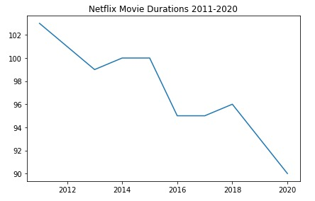

Data Science Project

# [Project 1: Investigating Netflix Movies and Guest Stars in The Office](https://github.com/Steve246/Data-Science-Project/blob/main/Investigating%20Netflix%20Movies%20and%20Guest%20Stars%20in%20The%20Office/notebook.ipynb) 

* Analyze Movie Duration in Netflix Streaming from 2011-2020 in form of line plot, and scatter plot.
* Done EDA over Netflix data from Kaggle using Pandas 
* Chart and visualize movie duration from different years using Matplotlib and Seaborn 

# [Analysis Result]
* Plot Line.
* 
* Scatter Plot
* 
